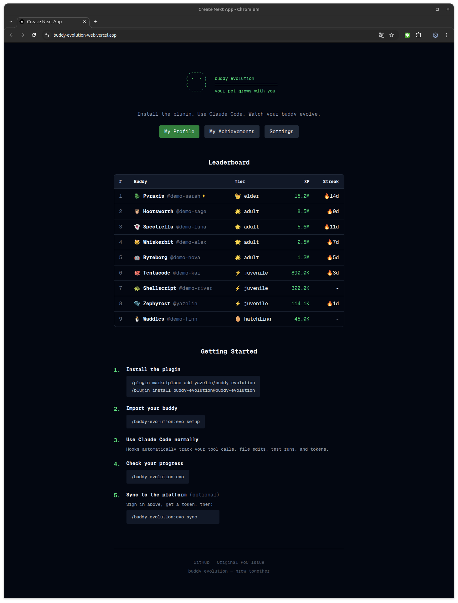
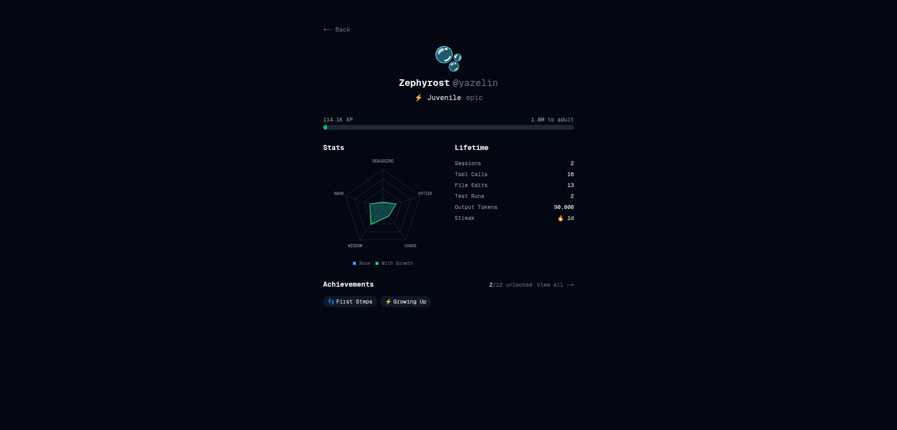
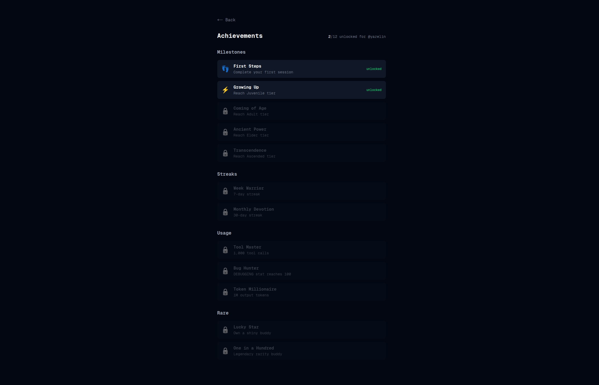

# Buddy Evolution

> **Notice (2026-04-01):** Anthropic has [confirmed](https://github.com/anthropics/claude-code/issues/41684#issuecomment-4172557121) that `/buddy` is an April Fools feature and will be removed soon. This plugin depends on `/buddy` and may stop working once it's removed.
>
> If you're looking for a **standalone** buddy progression system that works without the official `/buddy`, check out **[FrankFMY/buddy-evolution](https://github.com/FrankFMY/buddy-evolution)** — zero dependencies, fully local, no reliance on `/buddy`.
>
> See [sunset notice](docs/2026-04-01-buddy-sunset-notice.md) for details.

RPG evolution system for Claude Code's `/buddy` companion pet. Your pet grows based on actual usage — not RNG, not time gates, just how much you use Claude Code.



### Profile & Achievements

<p float="left">
  
  
</p>

## Install

In Claude Code, run:

```
/plugin marketplace add yazelin/buddy-evolution
/plugin install buddy-evolution@buddy-evolution
```

That's it. Dependencies install and build automatically.

### Requirements

- Claude Code v2.1+
- Node.js 20+
- pnpm

### Uninstall

In Claude Code, go to `/plugin` → Installed → buddy-evolution → Uninstall.

## Usage

### Commands

| Command | What it does |
|---------|-------------|
| `/buddy-evolution:evo` | Show your buddy's evolution status |
| `/buddy-evolution:evo setup` | Import your real `/buddy` data |
| `/buddy-evolution:evo stats` | Detailed lifetime statistics |
| `/buddy-evolution:evo sync` | Sync to the online platform |
| `/buddy-evolution:evo connect` | Connect to the platform with a token |

### Quick Start

```
1. /buddy-evolution:evo setup     ← imports your /buddy species, stats, name
2. /buddy-evolution:evo           ← see your buddy + XP progress
3. Use Claude Code normally        ← hooks track everything automatically
4. /buddy-evolution:evo           ← watch your XP grow!
5. /buddy-evolution:evo sync      ← upload to the online platform
```

## How It Works

### Automatic Tracking

The plugin installs hooks that track your Claude Code usage in real-time:

| Hook | What it tracks |
|------|---------------|
| `SessionStart` | Session start time |
| `PostToolUse` | Tool calls, file edits, test runs |
| `PostToolUseFailure` | Rejected tool calls |
| `PostCompact` | Context resets |
| `SessionEnd` | Parses transcript for token counts, calculates XP |

All tracking happens locally. Nothing is sent anywhere unless you explicitly `/evo sync`.

### XP Sources

| Source | Rate |
|--------|------|
| Output tokens | 1 XP per token |
| Input tokens | 0.5 XP per token |
| Tool calls | 100 XP each |
| 30+ min session | 5,000 bonus XP |
| Streak multiplier | 1.0x → 2.0x (caps at day 11) |

### Evolution Tiers

| Tier | XP Required | Visual Effect |
|------|------------|---------------|
| Hatchling | 0 | Base sprite |
| Juvenile | 100K | Corner energy markers |
| Adult | 1M | Species-specific pattern |
| Elder | 10M | Glowing aura border |
| Ascended | 100M | Floating star particles |

### Usage-Driven Stats

Stats grow based on how you actually use Claude Code:

| Stat | Driven By |
|------|-----------|
| DEBUGGING | File edits + test runs |
| WISDOM | Cumulative input tokens |
| CHAOS | Rejected tool call ratio |
| PATIENCE | Session duration |
| SNARK | Context resets + force snips |

Growth uses diminishing returns — fast early gains, asymptotic near the soft cap.

## Online Platform

Sync your buddy to the web platform for leaderboards, profiles, and achievements.

**Platform:** https://buddy-evolution-web.vercel.app

### Setup Sync

1. Visit [buddy-evolution-web.vercel.app/login](https://buddy-evolution-web.vercel.app/login)
2. Sign in with GitHub
3. Go to Settings → Generate Token
4. In Claude Code, run `/buddy-evolution:evo connect <token>` (or paste the full JSON config)
5. Run `/buddy-evolution:evo sync`

Your profile will be at `https://buddy-evolution-web.vercel.app/u/<github-username>`.

### Features

- **Leaderboard** — Global XP ranking
- **Profile page** — Stat radar chart, XP progress, lifetime stats
- **Compare** — Side-by-side buddy comparison (`/compare?a=user1&b=user2`)
- **Achievements** — 12 achievements across milestones, streaks, usage, and rare categories

### Achievements

| Achievement | Condition |
|------------|-----------|
| First Steps | Complete first session |
| Growing Up | Reach Juvenile tier |
| Coming of Age | Reach Adult tier |
| Ancient Power | Reach Elder tier |
| Transcendence | Reach Ascended tier |
| Week Warrior | 7-day streak |
| Monthly Devotion | 30-day streak |
| Tool Master | 1,000 tool calls |
| Bug Hunter | DEBUGGING stat reaches 100 |
| Lucky Star | Own a shiny buddy |
| One in a Hundred | Legendary rarity |
| Token Millionaire | 1M output tokens |

## Architecture

Monorepo with 3 packages:

```
buddy-evolution/
├── packages/core/       # Shared evolution engine (types, XP, stats, sprites)
├── packages/plugin/     # Claude Code plugin (hooks, CLI, /evo skill)
└── packages/web/        # Next.js platform (Supabase + Vercel)
```

### Tech Stack

| Layer | Technology |
|-------|-----------|
| Core engine | TypeScript |
| Plugin | Claude Code hooks + skills |
| Platform | Next.js 16 + Tailwind CSS |
| Database | Supabase (Postgres) |
| Auth | GitHub OAuth via Supabase |
| Hosting | Vercel (free tier) |
| Monorepo | pnpm workspaces + Turborepo |

### Data Storage

All evolution data is stored locally at `~/.buddy-evolution/`:

```
~/.buddy-evolution/
├── evolution-state.json    # XP, tier, stats, streak
├── current-session.json    # Active session metrics (temp)
└── sync-config.json        # Platform auth token + buddy config
```

## Development

```bash
git clone https://github.com/yazelin/buddy-evolution.git
cd buddy-evolution
pnpm install
pnpm build
pnpm test          # 90 tests across core + plugin
```

### Run tests

```bash
pnpm --filter @buddy-evolution/core test    # 58 tests
pnpm --filter @buddy-evolution/plugin test  # 32 tests
```

### Local dev (web platform)

```bash
cp packages/web/.env.local.example packages/web/.env.local
# Fill in Supabase credentials
pnpm --filter @buddy-evolution/web dev
```

## Credits

### Core Design
- **[@RaphaelRUzan](https://github.com/RaphaelRUzan)** — Original evolution system design: XP engine, tier thresholds, stat growth with diminishing returns, streak multipliers, sprite overlay pipeline. [PoC repo](https://github.com/RaphaelRUzan/buddy-evolution) / [Feature request #41684](https://github.com/anthropics/claude-code/issues/41684)

### Implementation
- **[@yazelin](https://github.com/yazelin)** — Claude Code plugin (hooks, session tracking, transcript parsing, `/evo` skill), web platform (Next.js + Supabase + Vercel)

### Community
- **[@Hegemon78](https://github.com/Hegemon78)** — Extended spec with achievement milestones, branching evolution, buddy journal ([buddy-evolution-spec](https://github.com/Hegemon78/buddy-evolution-spec))
- **[@FrankFMY](https://github.com/FrankFMY)** — Contextual familiarity concept, development philosophy evolution paths

## License

MIT
